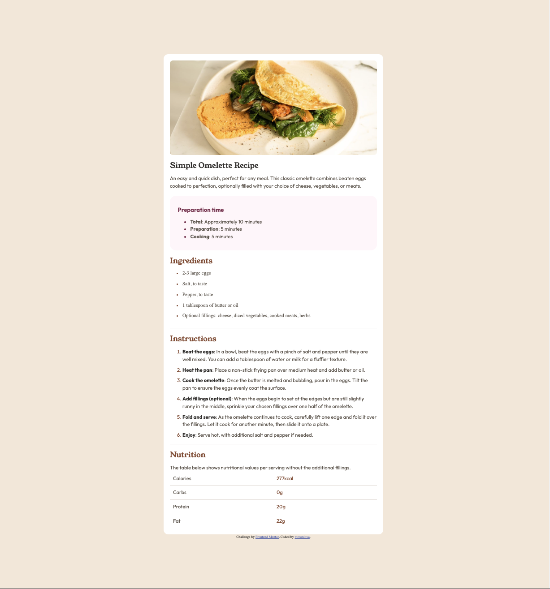

# Frontend Mentor - Recipe page solution

This is a solution to the [Recipe page challenge on Frontend Mentor](https://www.frontendmentor.io/challenges/recipe-page-KiTsR8QQKm). Frontend Mentor challenges help you improve your coding skills by building realistic projects.

## Table of contents

- [Overview](#overview)
  - [The challenge](#the-challenge)
  - [Screenshot](#screenshot)
  - [Links](#links)
- [My process](#my-process)
  - [Built with](#built-with)
  - [What I learned](#what-i-learned)
  - [Continued development](#continued-development)
  - [Useful resources](#useful-resources)
- [Author](#author)

## Overview

### Screenshot

### Links

- Solution URL: [Github repo](https://github.com/mrcordova/recipe-page)
- Live Site URL: [Github page](https://mrcordova.github.io/recipe-page/)

## My process

### Built with

- Semantic HTML5 markup
- CSS custom properties
- Flexbox

### What I learned

I learned how to rearrange items in flexboxes, and how to use aria label to make a flexbox readable to screenreader.

### Continued development

I want to continue to learn about how to use flexbox more effective and use css grid.

### Useful resources

- [Media Queries](https://developer.mozilla.org/en-US/docs/Web/CSS/CSS_media_queries/Using_media_queries) - This helped me on how to setup media queries and have the image expand.

- [Change color of dots](https://stackoverflow.com/questions/5839553/how-can-i-change-the-color-of-the-dot-in-an-unordered-list) - Helped me know how to only change the dot color.

- [Flexbox](https://developer.mozilla.org/en-US/docs/Web/CSS/flex) - I learned how flexboxes work and how I would set up a flexbox table.

## Author

- Website - [mrcordova](https://github.com/mrcordova/recipe-page)
- Frontend Mentor - [@mrcordova](https://www.frontendmentor.io/profile/mrcordova)
